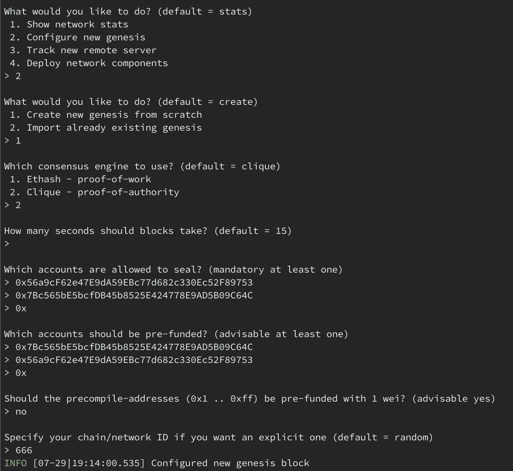
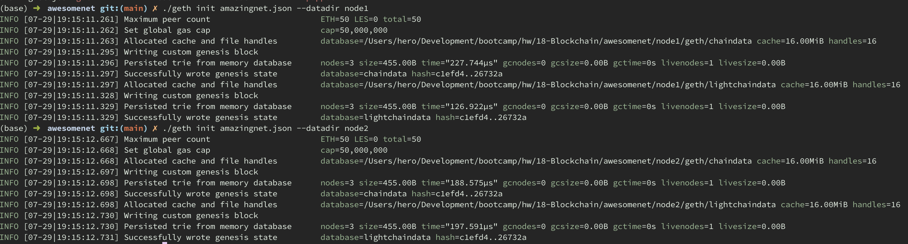
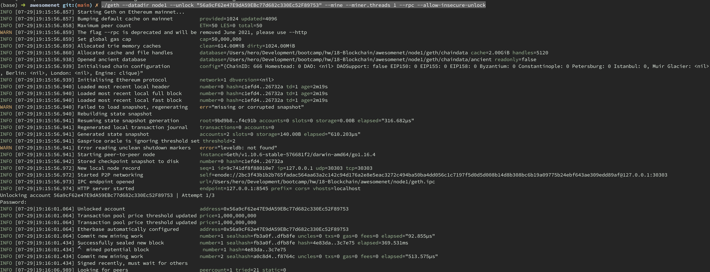
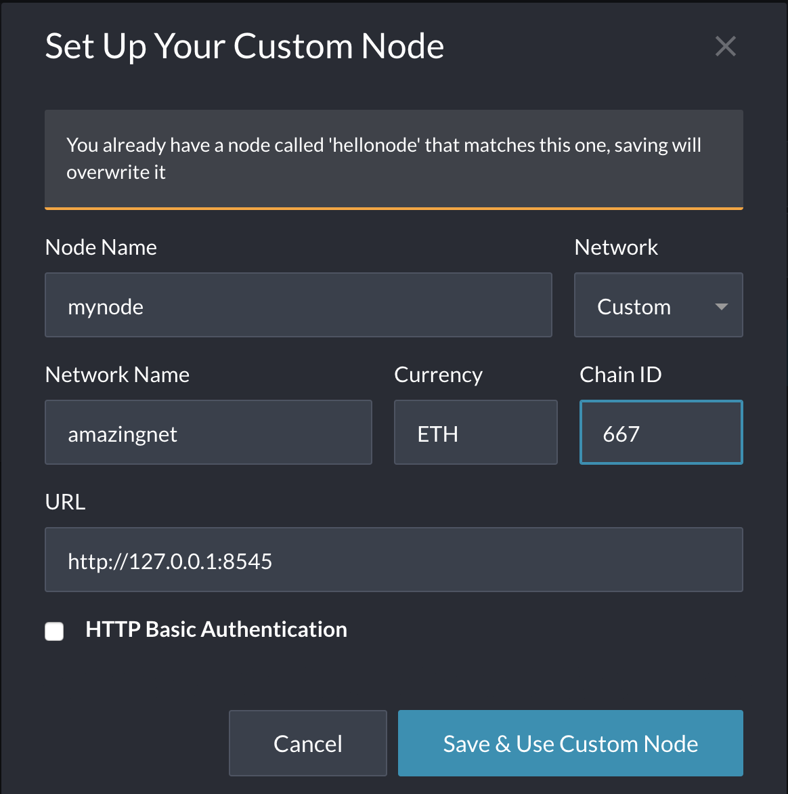
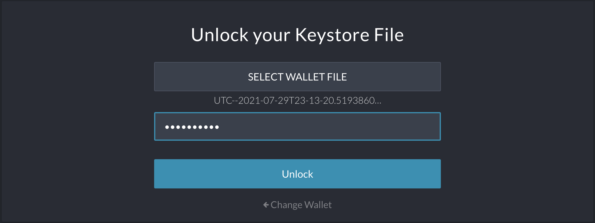
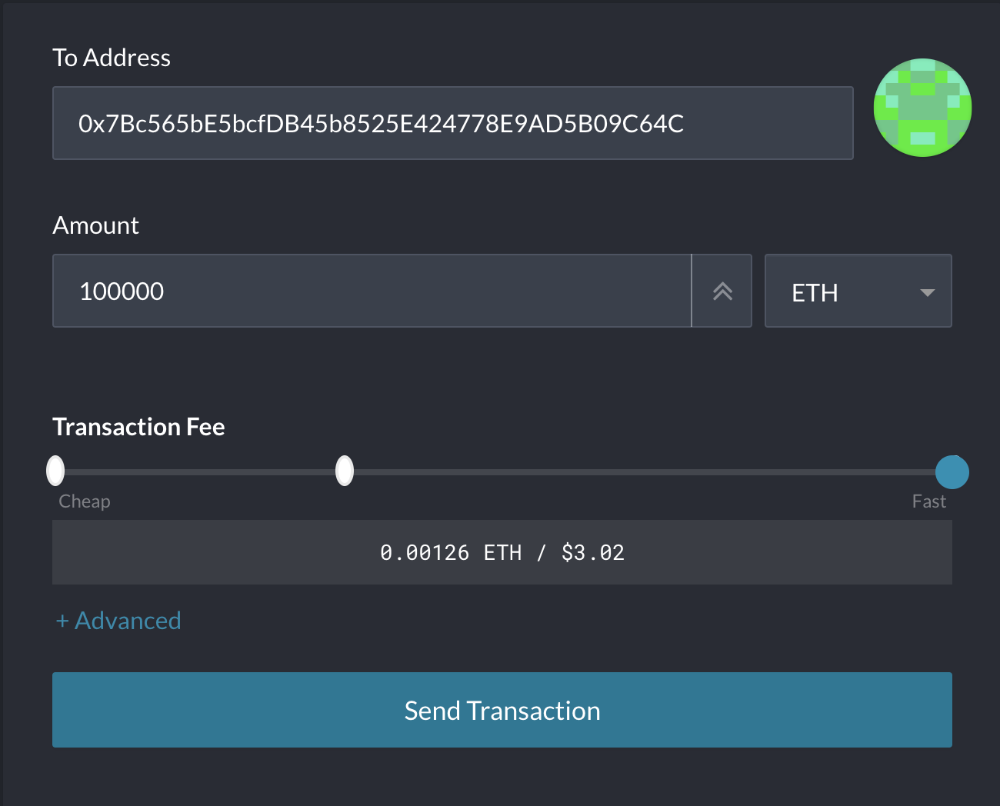
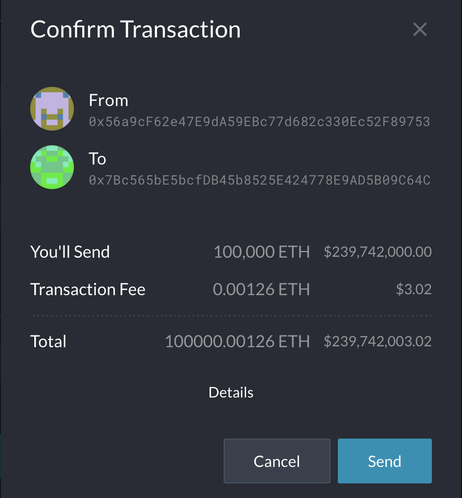
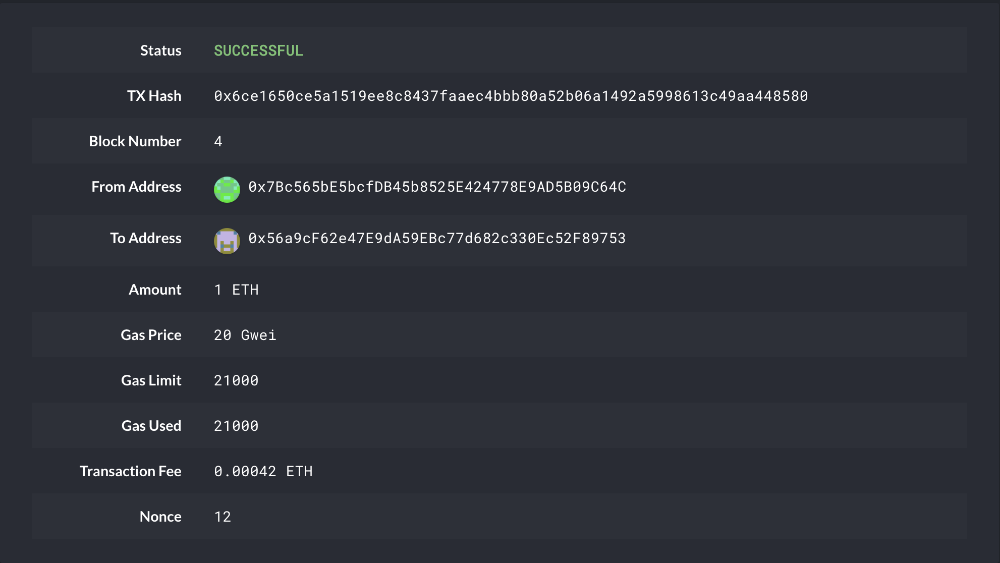

# 18-Blockchain

### The network

The network is setup using puppeth as follows:

The network configuration is exported to amazingnet.json, which was used to initialize nodes

### Starting the network

The name of the network is called amazingnet and it can be started as follows:
1. navigate to the amazingnet directory, which contains the json file about the network configuration and also pre-configured node1 and node2
2. start the first node with the command
    ./geth --datadir node1 --unlock "56a9cF62e47E9dA59EBc77d682c330Ec52F89753" --mine --miner.threads 1 --rpc --allow-insecure-unlock
    
3. this command unlocks the public address of node 1, tells the node to mine with one threads, opens up rpc port for communication and allows insecure unlock via HTTP.
4. similarly, the second node can be started with 
    ./geth --datadir node2 --unlock "7Bc565bE5bcfDB45b8525E424778E9AD5B09C64C" --port 30304 --bootnodes "enode://2bc3f43b1b2b765fadac564aa63a2c142c94d176a2e8e5eac3272c494ba50ba4dd056c1c7197f5d0d5d008b14d8b308bc6b19a09775b24ebf643ae309edd89af@127.0.0.1:30303" --allow-insecure-unlock --mine --miner.threads 1
5. this unlocks the public address of the second node and uses the encode of first node as bootnode for the second node
6. Both nodes should be able to connect to its peers and start mining.

### Doing transactions

First connect to the network in MyCrypto:
1. Select change network
2. choose custom network
3. add details of the amazingnet as shown

Connecting to your wallet:
1. use either private keys or keystore to connect to your wallet

Sending transactions
1. Enter the address that you want to send to
2. enter amount
3. enter gas information 

4. confirm transaction 

5. check your transaction status in TX Status

